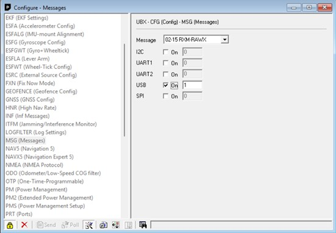
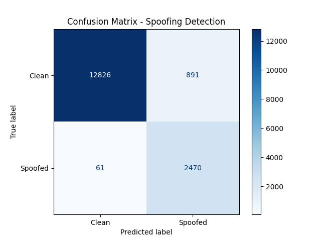
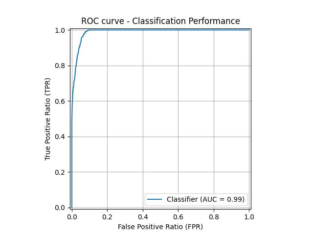
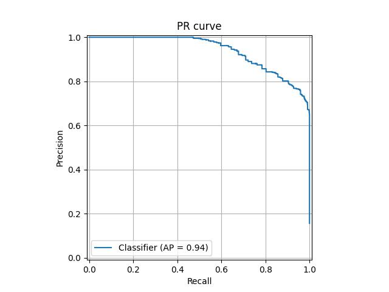
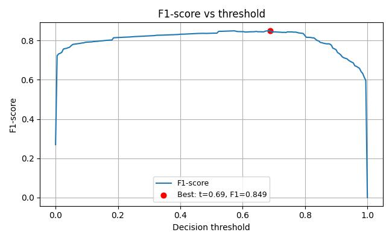
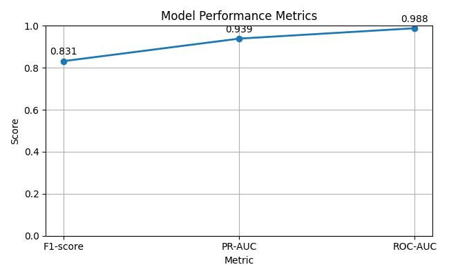

# GNSS Spoofing Detection with Machine Learning

This project investigates the detection of spoofed GNSS signals using machine learning techniques.

The system processes raw satellite observations, extracts signal-based features, and uses an XGBoost model to classify signals as authentic or spoofed.

Key components include:
- GNSS data collection using a u-blox NEO-M8T receiver
- RINEX data conversion and preprocessing
- Synthetic spoofing simulation
- Machine learning classification using XGBoost
- Evaluation using ROC, PR, and F1 metrics

## Purpose of this project

Global Navigation Satellite Systems (GNSS) have become a fundamental technological pillar of our everyday lives and critical infrastructures. From the navigation of autonomous vehicles, through positioning procedures in air traffic, to the time synchronization of financial transactions, numerous applications rely on the precise position and time information provided by GNSS. Parallel to the widespread adoption of these systems, however, intentional interference activities aimed at disrupting or falsifying satellite signals have become increasingly common. Signal spoofing represents a particularly serious security risk, as the counterfeit signals can transmit navigation information that is almost indistinguishable from genuine signals and appears authentic, making the manipulation extremely difficult for the system to detect.

The aim of this project was to research the possibilities of detecting spoofing with machine learning algorithms, especially `XGBoost` algorithm. The results are promising. Machine learning can be of help in identifying spoofed signals, especially combined with other detection techniques (for example physical methods like using multiple antennas).

## Requirements 

For specific requirements and dependencies, please read the `requirements.txt` file.

Use for example `pip install` method. E.g:  `pip install -r requirements.txt`

## Dataset 

To capture GNSS data I used a `NEO M8T` signal receiver module developed by `u-blox`. You can find the documentation of the module [here](https://www.u-blox.com/en/product/neolea-m8t-series). 

To record data I used `U-center`, which is a free software developed by u-blox for their GNSS modules. For the model training `RAWX` data were recorded.

Converting data recorded with u-center to RINEX format happened with `RTKLIB`, which is an opensource GNSS toolkit. You can read about RTKLIB [here](https://www.rtklib.com/rtklib_tutorial.htm). RINEX is a standardized ASCII file format used for storing and exchanging raw satellite navigation data.

With `rinex_conversion.py` RINEX files can be converted to CSV, what can be fed to the machine learning modell.

Since actually broadcasting spoofed signals is illegal and at the time of the research I did not have access to a safe enough laboratory environment, therefore the spoofed signals were created artificially with the help of `spoofing_simulation.py` (located in the src folder). In the future the model could be improved with recording spoofed signals from an SDR within a safe laboratory and train the model on that data as well. 

For **safety purposes** I haven't included the recorded GNSS data as location can be tracked back from the data set. If you'd like to test the code, then you need to record your own data and create your own spoofed samples.

Also exported model is 

## Columns of the dataset

The prediction model was trained on CSV data that contained the following columns (column name + description):

- `time_utc`: Data and time of recording in UTC
- `time`: Data and time of recording based on system time
- `sys`: Satellite system identifier
- `sv`: Space-Vehicle-Number: Serial number of the satellite
- `prn`: Pseudo-Random-Noise: The signal ID used to identify the satellite
- `pseudorange`: Pseudo distance between satellite and reciever
- `phase`: carrier phase of the given satellite
- `doppler`: Doppler shift of the signal
- `snr`: Signal to Noise ratio
- `time_s`: Time in seconds
- `delta_t`: Time differenece between epochs
- `delta_pr`: Change of the pseudorange
- `pr_rate`: The rate of change of the distance between the satellite and the reciever
- `wavelength`: Wavelength of the signal
- `doppler_vs_prrate`: Rate to measure consistency between doppler and pseudorange
- `snr_mean_5`: Mean Signal to Noise ratio accross the last five epochs
- `snr_std_5`: Standard deviation of Signal to Noise ratio accross the last five epochs
- `sat_count`: Number of satellites visible in the given epoch
- `n_missing_pr`: Number of missing pseudoranges (loss of signal)

The prediction model needs these columns to make a prediction as well. So the API accepts a `CSV file` only if it contains these columns.

## Model

The detection model was trained using XGBoost algorithm.

Training process:

1. GNSS observations were converted to CSV features
2. Spoofed samples were generated using the `spoofing_simulation.py` module
3. The dataset was split into training and validation sets
4. The model was trained using XGBoost classification
5. Performance was evaluated using ROC-AUC, PR-AUC and F1-score
 
## Model Evaluation

The performance of the prediction model was evaluated using several complementary metrics and diagnostic plots. These metrics provide insight into the classification behavior of the model, its ability to discriminate between classes, and the trade-offs between precision and recall at different decision thresholds.

### 1. Confusion Matrix

The confusion matrix summarizes the classification results by comparing the predicted labels with the true labels. It provides a detailed breakdown of:

- **True Positives (TP)** – correctly predicted positive instances  
- **True Negatives (TN)** – correctly predicted negative instances  
- **False Positives (FP)** – negative instances incorrectly classified as positive  
- **False Negatives (FN)** – positive instances incorrectly classified as negative 

### 2. ROC-curve

The Receiver Operating Characteristic (ROC) curve illustrates the model’s ability to distinguish between classes across different classification thresholds. It plots:

- **True Positive Rate (Sensitivity / Recall)** on the y-axis  
- **False Positive Rate** on the x-axis  

A model with strong discriminative ability will produce a curve that approaches the top-left corner of the plot. The ROC curve is commonly summarized using the **Area Under the Curve (AUC)**, where higher values indicate better overall classification performance.

### 3. PR-curve

The Precision–Recall (PR) curve visualizes the trade-off between **precision** and **recall** across varying classification thresholds. This metric is particularly informative when dealing with **imbalanced datasets**, where the positive class occurs much less frequently than the negative class.

- **Precision** measures the proportion of predicted positives that are actually correct.  
- **Recall** measures the proportion of actual positives that are correctly identified.

A higher area under the PR curve indicates a model that maintains strong precision while achieving high recall.

### 4. F1-score vs threshold

The F1-score represents the harmonic mean of precision and recall, providing a single metric that balances both measures. This plot shows how the **F1-score varies as the classification threshold changes**.

Analyzing this curve helps identify the **optimal decision threshold** that maximizes the balance between precision and recall, which is particularly useful when the default threshold (e.g., 0.5) is not ideal for the application.

### 5. Model Metrics

In addition to graphical diagnostics, the model performance is summarized using key evaluation metrics such as:

- **F1-score**
- **PR-AUC**
- **ROC-AUC**
 
These metrics provide a quantitative summary of the model’s predictive capability and allow for comparison with alternative models or configurations.

## How to Run

